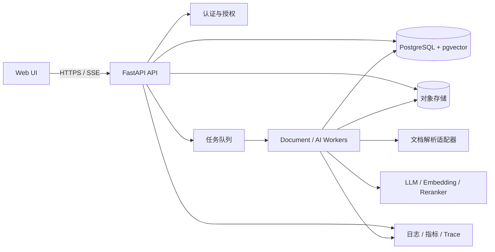

# 系统架构文档

版本：0.1
架构目标：在保持首版交付速度的同时，确保业务模块可测试、基础设施可替换、耗时任务可水平扩展。

## 1. 架构师视角的核心决策

### 1.1 采用模块化单体，而不是一开始微服务化

API、领域逻辑和数据访问先部署为一个应用，但代码按领域隔离。文档解析和模型调用由独立 Worker 进程消费任务。这样可以共享事务与类型定义、减少网络和运维成本；当某个模块出现独立扩容或团队边界时，再按接口拆为服务。

禁止把“模块化单体”写成一个巨大的 `services.py`。每个领域拥有自己的实体、用例、接口和基础设施适配器。

### 1.2 PostgreSQL 是唯一事实源

- PostgreSQL 保存业务数据、处理状态和审计数据。
- pgvector 保存首版向量，降低数据同步复杂度。
- 原始文件和解析产物放对象存储；数据库只保存对象键、哈希和元数据。
- Redis 仅作为任务队列、短期缓存或限流，不保存不可恢复的业务事实。

### 1.3 外部能力必须通过端口适配

LLM、Embedding、重排、对象存储、文档解析、任务队列均定义应用侧接口。领域用例依赖接口，不直接依赖 OpenAI SDK、S3 SDK、某个解析库或队列实现。

## 2. 目标架构



当前本地环境用 Docker Compose 运行 React Web、API、Worker、PostgreSQL 和兼容 S3 的 MinIO。Web 通过同源 Node 代理调用 API，本地访问令牌只存在于代理进程环境中，不进入浏览器包。生产环境需用正式认证网关替代该单用户开发代理，并使用托管 PostgreSQL 与对象存储，API 和 Worker分别扩缩容。

### 2.1 技术选型基线

| 层 | 建议技术 | 选择理由与边界 |
| --- | --- | --- |
| Web 前端 | React + TypeScript + Vite | 类型清晰、组件生态成熟；服务端状态与本地 UI 状态分离 |
| 前端数据 | TanStack Query | 管理请求、缓存、失效和重试；不把服务端数据复制到全局 store |
| 前端路由 | React Router | 页面与深链接清晰；资料、对话、Quiz 都有稳定 URL |
| UI 基础 | CSS variables + utility CSS + accessible headless primitives | Token 可换主题；交互可访问；业务组件仍由项目拥有 |
| API | Python 3.13 + FastAPI + Pydantic | 延续当前环境；异步 HTTP、schema 与 OpenAPI 支持良好 |
| 数据访问 | SQLAlchemy 2 async + Alembic | 显式会话/事务与可审查迁移；Repository 只在有业务边界处使用 |
| 数据库 | PostgreSQL 17 + pgvector | 事务数据与首版向量共址，降低一致性和运维成本 |
| 后台任务 | PostgreSQL 持久化任务表 + 独立 Worker | 当前负载下与业务写入原子提交，具备租约与幂等；达到迁移门槛后再接外部 broker |
| 文件存储 | S3-compatible；本地 MinIO | 原始文件不占数据库；通过统一 adapter 切换云供应商 |
| 实时反馈 | SSE 优先 | 生成输出主要是服务端单向流；比 WebSocket 更简单，断线可恢复 |
| 观测 | OpenTelemetry + 结构化日志 | 统一 API、Worker、数据库和模型调用的 trace |
| 测试 | pytest；前端 Vitest/Testing Library/Playwright | 单元、集成、契约与关键旅程分层 |

当前任务队列决策见 [ADR-0001](./adr/0001-postgresql-document-jobs.md)。当任务吞吐、隔离队列、调度或跨服务消费达到实测门槛时，可增加 Celery/Redis 或云队列；任务状态仍以 PostgreSQL 为事实源，不能把 broker/result backend 当作业务记录。MinIO 使用固定版本，本地 bucket 默认私有，应用凭据只允许访问文档 bucket。

### 2.2 前端状态边界

- 服务端状态（资料列表、处理进度、消息、Quiz）由 Query cache 管理；资料处理中使用有界轮询，完成后自动停止。
- URL 状态（当前资料、集合、筛选、来源位置）进入路由，保证刷新与分享后可恢复。
- 临时 UI 状态（侧栏宽度、主题、对话框）使用组件状态或小型 store。
- 未提交的长表单草稿可保存本地，但提交成功后以服务端结果为准。
- 禁止把同一实体复制到 Query cache、全局 store 和组件 state 三处维护。

## 3. 代码边界

```text
app/
  main.py                    # 应用组装，不放业务规则
  api/                       # 路由、鉴权依赖、HTTP schema
    v1/
  core/                      # 配置、日志、数据库、通用安全能力
  documents/
    domain/                  # 实体、值对象、领域规则
    application/             # 上传/索引/删除用例，端口定义
    infrastructure/          # SQLAlchemy、存储、解析器实现
  rag/
    domain/
    application/
    infrastructure/
  conversations/
  quizzes/
  jobs/                      # 任务入口、重试策略，不复制业务逻辑
  shared/                    # 极少量稳定的跨领域类型
tests/
  unit/
  integration/
  contract/
  e2e/
```

依赖方向：

```text
API / Worker → Application → Domain
Infrastructure ───────────→ Application ports / Domain
```

Domain 不导入 FastAPI、SQLAlchemy、模型 SDK、Redis 或对象存储 SDK。跨模块调用优先使用对方的 application 用例，不直接读取对方 repository。

## 4. 关键数据流

### 4.1 文档摄取

1. API 流式校验扩展名、MIME、PDF 魔数或 OOXML 包结构和大小，同时计算 SHA-256；压缩包同时限制成员数、解压大小和压缩比。
2. API 用 workspace/document UUID 生成对象键，将原文件写入私有对象存储；原始文件名不参与路径。
3. 文档与 `document_parse` 任务通过数据库幂等键持久化，API 立即返回 `202 Accepted`；迁移期仍允许消费已有 `pdf_parse` 任务。
4. Worker 通过 `FOR UPDATE SKIP LOCKED` 和租约领取任务，下载文件，在禁止网络且具有超时、内容量和解压上限的子进程中解析。
5. PDF 页、DOCX 标题段和 PPTX 幻灯片统一写入有序内容单元；每个单元携带 `citation_locator`（kind、position、title、path）。版本创建与 `active_version_id` 切换在同一事务完成，同一来源和解析器版本不会重复写入。
6. 后续分块与 Embedding 完成后，继续沿版本化产物和原子激活扩展，禁止暴露半成品。

重要约束：任务采用至少一次投递，因此每一步必须幂等；禁止假定任务只执行一次。

### 4.2 RAG 问答

```text
问题 + 对话摘要 + 资料范围
  → 查询规范化/安全检查
  → 向量检索 + PostgreSQL 全文检索
  → 权限过滤
  → 融合与重排
  → 上下文预算组装
  → 带引用生成
  → 引用/输出校验
  → 流式返回并持久化
```

权限过滤必须进入检索 SQL，而不是检索后在 Python 中过滤，防止越权内容进入模型上下文。原始用户问题、检索结果、Prompt 版本、模型参数、Token 与引用关系应可审计，但日志默认不记录完整文档正文。

### 4.3 Quiz 生成

Quiz 生成不是一次自由文本调用，而是受约束的流水线：

1. 生成知识点和题目蓝图。
2. 按蓝图检索证据。
3. 使用结构化输出生成候选题。
4. 执行 schema、答案唯一性、重复度、引用与难度启发式校验。
5. 不合格题目有限次数重试；通过的题目组成不可变版本。

## 5. Agent 设计边界

MVP 使用受控工作流 Agent，而不是无限循环的通用 Agent。

- 可用工具采用允许列表：检索资料、读取指定来源、生成 Quiz 草稿、保存结果。
- 每次运行设置最大步骤、超时、Token 和费用预算。
- 工具入参用 Pydantic schema 校验；模型输出不直接拼 SQL、文件路径或系统命令。
- 高风险或不可逆操作（删除、分享、覆盖）由确定性业务代码执行并要求显式用户动作。
- Prompt 是版本化配置，进入评测和变更审查，不散落在路由代码中。

## 6. 扩展性策略

| 变化 | 预留方式 |
| --- | --- |
| 更换 LLM/Embedding | Provider 接口 + 模型配置表 + Prompt 版本 |
| 增加文件类型 | `DocumentParser` 注册表，不修改领域用例 |
| 向量量增长 | 先优化 pgvector 索引；达到实测门槛再引入专用向量库 |
| Worker 压力增长 | API/Worker 独立部署；按任务类型拆队列并水平扩容 |
| 多租户 | 所有资源带 workspace 所有权，查询强制 scope，生产可启用 RLS |
| 多语言 | 保存语言元数据；分块、检索、Prompt 和 UI 文案均可配置 |
| 多版本索引 | `index_version` + 原子激活，旧版本延迟回收 |

不预先拆微服务。只有满足以下任一条件才评审拆分：独立扩缩容持续成为瓶颈、发布节奏冲突、数据隔离要求不同，或团队所有权形成长期边界。

## 7. 性能设计

- API 进程不执行 OCR、Office 转换、长文本解析或大批量 Embedding。
- 上传和下载流式处理，不把整文件读入内存；生产优先使用对象存储签名 URL。
- 文档列表使用游标分页；禁止无限列表和深度 offset。
- Embedding 批处理并设置供应商并发上限；失败使用指数退避和抖动。
- RAG 先过滤 workspace/document/version，再搜索；限制候选数与上下文 Token。
- 热点元数据可短期缓存，但缓存失效不能影响授权正确性。
- 所有性能优化以 trace 和查询计划为依据，避免为了假设规模增加重复系统。

## 8. 可靠性与一致性

- 数据库内写入使用短事务；外部模型调用不持有数据库事务或行锁。
- 原文件先写入不可公开访问的对象键，随后文档与任务记录在同一 PostgreSQL 事务提交；数据库提交失败会补偿删除对象。进程硬中断仍可能留下无数据库引用的对象，因此生产需增加按宽限期执行的对象一致性扫描。
- 当前任务记录与文档状态在同一 PostgreSQL 事务提交，不存在数据库提交后 broker 消息丢失的窗口；引入外部 broker 时必须增加 Outbox。
- Worker 使用任务租约、尝试上限和幂等键；进程中断后租约到期可重新领取，解析失败保存稳定错误码并支持显式重试。
- 文档删除先进入 `deleting` 并取消待处理任务，再删除私有对象和派生版本；业务查询始终排除 `deleted` 数据。
- 对象存储与数据库不支持分布式事务，通过补偿任务和定期一致性扫描修复。

## 9. 安全架构

- API 只信任经过验证的用户身份；每个资源访问都执行对象级授权。
- 文件先校验请求体与文件大小、扩展名、声明类型和魔数，再使用独立子进程解析；文件名不参与真实存储路径。
- 解析子进程不继承应用密钥，并通过 Python 审计钩子拒绝 socket 访问。生产环境仍应把解析器放入无网络、只读文件系统、资源受限的独立沙箱，防止解析器漏洞突破进程级边界。
- Prompt injection 按不可信文档内容处理：资料不能修改系统规则或调用权限。
- 密钥来自 Secret Manager/环境注入；不提交 Git、不返回客户端、不写日志。
- 对外错误使用稳定错误码；内部异常、SQL 和凭据不暴露。
- 数据库使用 TLS、最小权限角色、连接池上限、加密备份和恢复演练。

## 10. 可观测性

所有请求和后台任务使用结构化日志，并至少包含：`request_id`、`trace_id`、`user_id_hash`、`workspace_id`、`job_id`、模块、耗时、结果和稳定错误码。

重点指标：

- API 延迟、错误率、连接池等待和慢查询。
- 队列长度、任务等待时间、重试率、死信量。
- 每类文档解析耗时与失败率。
- 检索召回、重排耗时、上下文长度、无证据回答率。
- 模型 Token、费用、限流和供应商错误率。

正文、Prompt 和回答属于潜在敏感内容，不应默认进入普通应用日志。

## 11. 架构决策记录（ADR）

重大决策放在 `docs/adr/NNNN-title.md`，至少包含背景、决策、替代方案、后果和状态。首批 ADR 应覆盖：

1. 模块化单体与拆分条件。
2. PostgreSQL + pgvector 的选择与迁移门槛。
3. 对象存储与文件删除语义。
4. 任务队列和 Outbox 实现。
5. LLM/Embedding 提供商及数据处理合规性。

## 12. 技术参考

- [pgvector 官方文档](https://github.com/pgvector/pgvector)：近似索引、混合检索、过滤、迭代扫描和多租户注意事项。
- [Celery 官方文档](https://docs.celeryq.dev/en/stable/getting-started/introduction.html)：任务队列、broker 和多 Worker 模型。
