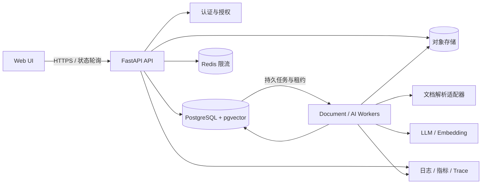

# 系统架构文档

版本：0.1
架构目标：在保持首版交付速度的同时，确保业务模块可测试、基础设施可替换、耗时任务可水平扩展。

## 1. 架构师视角的核心决策

### 1.1 采用模块化单体，而不是一开始微服务化

API、领域逻辑和数据访问先部署为一个应用，但代码按领域隔离。文档解析和模型调用由独立 Worker 进程消费任务。这样可以共享事务与类型定义、减少网络和运维成本；当某个模块出现独立扩容或团队边界时，再按接口拆为服务。

禁止把“模块化单体”写成一个巨大的 `services.py`。每个领域拥有自己的实体、用例、接口和基础设施适配器。

### 1.2 PostgreSQL 是唯一事实源

- PostgreSQL 保存业务数据、处理状态和审计数据。
- pgvector 保存首版向量，降低数据同步复杂度。
- 原始文件放私有对象存储；有序解析正文、分块、向量、来源定位与业务元数据保存在 PostgreSQL，便于授权查询和版本追溯。
- PDF 预览通过带工作区授权的 `/api/v1/documents/{id}/original` 获取私有原文件，API 在事务结束后下载并临时发送，响应结束即清理；前端按需加载 PDF.js 绘制当前页，页数由原文件确定，预览不依赖解析完成。提取正文仅供后台检索、问答和练习使用；新上传只接受 PDF，历史非 PDF 记录仍可读取已保存的引用。
- Redis 当前只用于短期限流；未来若引入队列或缓存，也不保存不可恢复的业务事实。

### 1.3 外部能力必须通过端口适配

LLM、Embedding、重排、对象存储、文档解析、任务队列均定义应用侧接口。领域用例依赖接口，不直接依赖 OpenAI SDK、S3 SDK、某个解析库或队列实现。

## 2. 架构概览

图中 PostgreSQL 任务投递与 Redis 限流是当前路径；SSE 是后续目标，当前问答与学习任务由前端轮询状态。


```mermaid
flowchart LR
    UI[Web UI] -->|HTTPS / 状态轮询| API[FastAPI API]
    API --> AUTH[认证与授权]
    API --> PG[(PostgreSQL + pgvector)]
    API --> OBJ[(对象存储)]
    PG -->|持久任务与租约| WORKER[Document / AI Workers]
    WORKER --> OBJ
    WORKER --> PG
    WORKER --> PARSER[文档解析适配器]
    WORKER --> AI[LLM / Embedding]
    API --> REDIS[(Redis 限流)]
    API --> OBS[日志 / 指标 / Trace]
    WORKER --> OBS
```

当前本地环境用 Docker Compose 运行 React Web、API、Worker、PostgreSQL、Redis 和兼容 S3 的 MinIO。Web 通过同源代理调用 API；用户使用邮箱、密码和服务端会话登录。认证账号与工作区成员关系位于应用 schema，密码哈希与会话摘要位于独立认证 schema。单机独立站点方案使用 Caddy；[当前 fisher-ai.com 部署](./deployment-fisher-ai.md)使用宝塔 Nginx 子路径和现有门户身份。两种部署方式与恢复要求见[生产运维手册](./production-operations.md)。当前线上未启用异机备份，不能宣称已完成恢复演练。生产 Cookie 使用 Secure/HttpOnly/SameSite 和 CSRF 校验；本地脚本令牌仅在开发模式有效。

### 2.1 技术选型基线

| 层 | 建议技术 | 选择理由与边界 |
| --- | --- | --- |
| Web 前端 | React + TypeScript + Vite | 类型清晰、组件生态成熟；服务端状态与本地 UI 状态分离 |
| 前端数据 | TanStack Query | 管理请求、缓存、失效和重试；不把服务端数据复制到全局 store |
| 前端路由 | React Router | 页面与深链接清晰；资料、对话、Quiz 都有稳定 URL |
| UI 基础 | CSS variables + utility CSS + accessible headless primitives | Token 可换主题；交互可访问；业务组件仍由项目拥有 |
| API | Python 3.13 + FastAPI + Pydantic | 延续当前环境；异步 HTTP、schema 与 OpenAPI 支持良好 |
| 数据访问 | SQLAlchemy 2 async + Alembic | 显式会话/事务与可审查迁移；Repository 只在有业务边界处使用 |
| 数据库 | PostgreSQL 17 + pgvector | 事务数据与首版向量共址，降低一致性和运维成本 |
| 后台任务 | PostgreSQL 持久化任务表 + 独立 Worker | 当前负载下与业务写入原子提交，具备租约与幂等；达到迁移门槛后再接外部 broker |
| 文件存储 | S3-compatible；本地 MinIO | 原始文件不占数据库；通过统一 adapter 切换云供应商 |
| 实时反馈 | SSE 优先 | 生成输出主要是服务端单向流；比 WebSocket 更简单，断线可恢复 |
| 观测 | OpenTelemetry + 结构化日志 | 统一 API、Worker、数据库和模型调用的 trace |
| 测试 | pytest；前端 Vitest/Testing Library/Playwright | 单元、集成、契约与关键旅程分层 |

当前 Redis 只保存带 TTL 的 API 限流计数，不缓存文档正文、问答、会话或权限结果；Redis 故障时受限写操作返回稳定的 503，读取仍可用。当前任务队列决策见 [ADR-0001](./adr/0001-postgresql-document-jobs.md)。当任务吞吐、隔离队列、调度或跨服务消费达到实测门槛时，可增加 Celery/Redis 或云队列；任务状态仍以 PostgreSQL 为事实源，不能把 broker/result backend 当作业务记录。MinIO 使用固定版本，本地 bucket 默认私有，应用凭据只允许访问文档 bucket。

### 2.2 前端状态边界

- 服务端状态（资料列表、处理进度、消息、Quiz）由 Query cache 管理；资料处理中使用有界轮询，完成后自动停止。
- URL 状态（当前资料、集合、筛选、来源位置）进入路由，保证刷新与分享后可恢复。
- 临时 UI 状态（侧栏宽度、主题、对话框）使用组件状态或小型 store。
- 未提交的长表单草稿可保存本地，但提交成功后以服务端结果为准。
- 禁止把同一实体复制到 Query cache、全局 store 和组件 state 三处维护。

## 3. 代码边界

以下是当前代码的主要目录；随着业务演进按真实边界增补，不为目标架构预建空模块。

```text
app/
  main.py                    # 应用组装
  auth/                      # 账号、会话与工作区身份
  core/                      # 配置、数据库、日志与通用安全能力
  documents/                 # 文档领域、应用用例与基础设施适配器
  rag/                       # 索引、检索、引用与单资料问答
  learning/                  # 集合、对话、Quiz、Agent 运行与组织
  jobs/                      # Worker 入口与心跳
tests/                       # 后端行为与集成测试
web/                         # React 页面、组件及前端测试
```

依赖方向：

```text
API / Worker → Application → Domain
Infrastructure ───────────→ Application ports / Domain
```

Domain 不导入 FastAPI、SQLAlchemy、模型 SDK、Redis 或对象存储 SDK。跨模块调用优先使用对方的 application 用例，不直接读取对方 repository。

## 4. 关键数据流

### 4.1 文档摄取

1. API 流式校验扩展名、MIME、PDF 魔数或 OOXML 包结构和大小，同时计算 SHA-256；压缩包同时限制成员数、解压大小和压缩比。
2. API 用 workspace/document UUID 生成对象键，将原文件写入私有对象存储；原始文件名不参与路径。
3. 文档与 `document_parse` 任务通过数据库幂等键持久化，API 立即返回 `202 Accepted`；迁移期仍允许消费已有 `pdf_parse` 任务。
4. Worker 通过 `FOR UPDATE SKIP LOCKED` 和租约领取任务，下载文件，在禁止网络且具有超时、内容量和解压上限的子进程中解析。
5. 新资料的 PDF 页写入有序内容单元；每个单元携带 `citation_locator`（kind、position、title、path）。历史资料的标题和幻灯片 locator 保持可读。版本创建与 `active_version_id` 切换在同一事务完成，同一来源和解析器版本不会重复写入。
6. 后续分块与 Embedding 写入对应 profile 的版本化索引；只有全部向量完成后索引才标为 `ready`，未完成索引不可用于问答。

重要约束：任务采用至少一次投递，因此每一步必须幂等；禁止假定任务只执行一次。

### 4.2 RAG 问答

单资料闭环见 [RAG 实现与验收](./rag-implementation.md)。`learning` 模块在此基础上实现集合、多资料范围、连续对话、反馈与 Quiz。多资料问答使用模型选择只读工具的受控 Agent；Quiz 可显式选择实验 Agent 模式，默认 Quiz 和单资料旧接口保留固定流程。API 在短事务中持久化任务，Worker 执行模型调用后以租约标识原子发布；解析状态与索引状态独立。回答引用和 Quiz 来源绑定不可变解析版本，阅读器允许定位历史版本。流式返回仍是目标能力，目前使用轮询。图工作流按当前请求生成有界步骤清单；同一对话和完全相同的资料版本范围内保存最多 700 字的会话提示，并带入最近三条已完成消息。该提示只用于理解指代和偏好，不能作为资料事实或写操作授权。

```text
问题 + 对话摘要 + 资料范围
  → 查询规范化/安全检查
  → workspace / 选中资料 / 当前版本 / 未删除范围约束
  → 范围内向量检索 + PostgreSQL 全文检索
  → 融合与重排
  → 上下文预算组装
  → 带引用生成
  → 引用/输出校验
  → 校验后持久化，前端轮询结果
```

权限过滤必须进入检索 SQL，而不是检索后在 Python 中过滤，防止越权内容进入模型上下文。审计记录使用稳定 ID、策略版本、用量与结果类别；普通日志不记录用户问题、检索正文、Prompt 或完整回答。

历史 v2/v3 整份资料概括按页序抽样最多 15 个片段。新建 v4 运行使用下文的分批覆盖策略，并记录实际读取的页数、完整页数及正文片段数。问答仍走相关性检索；两种结果的 PDF 知识点都使用相同的引用校验。学习 Agent 可用模型通用知识解释已提取的知识点，讲解不作为 PDF 引用的证明，正文不显示来源归属标签；单资料阅读页问答仍只依据检索证据。知识点 PDF 从已发布答案即时排版，不保存第二份文件；授权下载时重新验证工作区、已发布输出和原资料版本，资料删除或换版后拒绝下载。

### 4.3 Quiz 生成

Quiz 生成不是一次自由文本调用，而是受约束的流水线：

1. 生成知识点和题目蓝图。
2. 按蓝图检索证据。
3. 使用结构化输出生成候选题。
4. 执行 schema、答案唯一性、重复度、引用与难度启发式校验。
5. 不合格题目有限次数重试；通过的题目组成不可变版本。

## 5. Agent 设计边界

当前学习助手先规划用户请求为问答、创建 Quiz、复习错题、薄弱点练习或澄清，再由应用执行对应流程；资料检索限于用户所选范围。详细分阶段方案见 [Agent 开发计划](./agent-development-plan.md)。

- 模型只能选择 `search`、`read_source` 和 `answer`；Pydantic 校验动作与参数，应用侧执行工具。`read_source` 只能读取本次限域检索命中的来源。
- 证据规划最多 5 个工具步骤、2 次搜索、3 次读取。统一对话最多 7 次模型调用（任务规划 1 + 证据规划最多 5 + 最终生成 1），共用 18,000 计费 Token、30,000 加权费用单位和 110 秒超时；独立 Quiz 无任务规划，最多 6 次。加权单位用于限制相对支出，不等同真实美元价格。
- 工具轨迹只持久化动作、命中数量及已读来源 ID，不保存搜索词、资料正文或完整 Prompt。最终回答仍必须通过来源摘录校验；没有读取有效证据时只能返回证据不足。
- Quiz Agent 只能选择 `search`、`read_source`、`generate_quiz`，不能使用问答的终止工具，也不能修改蓝图或直接发布。复用限域证据执行器与预算；应用校验候选后将题目和私有 `generation_usage` 一起发布。实验模式由 `config.generation_mode` 显式开启。
- 每步规划前、返回后与最终生成前检查任务租约及资料有效性；取消或删除后不继续启动后续付费调用，已发出的请求可能无法撤回。
- 对话出题的数量/题型/难度采用严格蓝图；模型无权选择 workspace、资料 ID、作答 ID 或发布接口。应用从当前精确范围读取最近已提交作答，替换薄弱点参数；不会让模型创造成绩。Quiz 与消息结果在同一事务发布，无第二套任务状态。数据库空间锁串行预留每小时 20 次出题配额，对话与独立 Quiz 共用限额。
- 已有 20 条版本化合成评测样本和显式付费的基线对比入口；真实资料语义评测、供应商账单校准和全局费用告警仍待完成。

更广的 Agent 能力继续遵守以下设计边界：

- 可用工具采用允许列表：检索资料、读取指定来源、生成 Quiz 草稿、保存结果。
- 每次运行设置最大步骤、超时、Token 和费用预算。
- 工具入参用 Pydantic schema 校验；模型输出不直接拼 SQL、文件路径或系统命令。
- 高风险或不可逆操作（删除、分享、覆盖）由确定性业务代码执行并要求显式用户动作。
- Prompt 是版本化配置，进入评测和变更审查，不散落在路由代码中。

## 6. 扩展性策略

| 变化 | 预留方式 |
| --- | --- |
| 更换 LLM/Embedding | Provider 接口 + 模型配置表 + Prompt 版本 |
| 增加文件类型 | `DocumentParser` 注册表，不修改领域用例 |
| 向量量增长 | 先优化 pgvector 索引；达到实测门槛再引入专用向量库 |
| Worker 压力增长 | API/Worker 独立部署；按任务类型拆队列并水平扩容 |
| 多租户 | 所有资源带 workspace 所有权，查询强制 scope，生产可启用 RLS |
| 多语言 | 保存语言元数据；分块、检索、Prompt 和 UI 文案均可配置 |
| 多版本索引 | `index_version` + 原子激活，旧版本延迟回收 |

不预先拆微服务。只有满足以下任一条件才评审拆分：独立扩缩容持续成为瓶颈、发布节奏冲突、数据隔离要求不同，或团队所有权形成长期边界。

## 7. 性能设计

- API 进程不执行 OCR、长文本解析或大批量 Embedding。
- 上传和下载流式处理，不把整文件读入内存；生产优先使用对象存储签名 URL。
- 文档列表使用游标分页；禁止无限列表和深度 offset。
- Embedding 批处理并设置供应商并发上限；失败使用指数退避和抖动。
- RAG 先过滤 workspace/document/version，再搜索；限制候选数与上下文 Token。
- 热点元数据可短期缓存，但缓存失效不能影响授权正确性。
- 所有性能优化以 trace 和查询计划为依据，避免为了假设规模增加重复系统。

## 8. 可靠性与一致性

- 数据库内写入使用短事务；外部模型调用不持有数据库事务或行锁。
- 原文件先写入不可公开访问的对象键，随后文档与任务记录在同一 PostgreSQL 事务提交；数据库提交失败会补偿删除对象。进程硬中断仍可能留下无数据库引用的对象，因此生产需增加按宽限期执行的对象一致性扫描。
- 当前任务记录与文档状态在同一 PostgreSQL 事务提交，不存在数据库提交后 broker 消息丢失的窗口；引入外部 broker 时必须增加 Outbox。
- Worker 使用任务租约、尝试上限和幂等键；进程中断后租约到期可重新领取，解析失败保存稳定错误码并支持显式重试。
- Worker 按通道并发运行（`app/jobs/lanes.py`）：`interactive`（单资料问答、对话消息、简答评分，默认 2 并发）、`agent`（图运行、出题，默认 1）、`ingest`（PDF 解析/OCR、向量索引，默认 1）。长时间 OCR 或多阶段 Agent 不再阻塞用户问答；同一通道内按原顺序轮询以保持公平。`WORKER_LANES` 可让不同容器只运行部分通道；所有任务都以 `SKIP LOCKED` 和带令牌的租约领取，可安全多实例。单个步骤的意外异常只记录并退避，不终止其他通道。
- 文档解析任务在处理期间每 `JOB_LEASE_SECONDS/3` 续租一次，租约可短于解析超时。领取时递增的 `attempt_count` 作为令牌：续租、完成和失败写入都要求令牌一致，被其他 Worker 接管后旧执行者的结果被丢弃，续租失败时立即取消本地解析并终止 OCR 子进程组。
- 文档删除先进入 `deleting` 并取消待处理任务，再删除私有对象和派生版本；业务查询始终排除 `deleted` 数据。
- 对象存储与数据库不支持分布式事务，通过补偿任务和定期一致性扫描修复。

## 9. 安全架构

- API 只信任经过验证的用户身份；每个资源访问都执行对象级授权。
- 文件先校验请求体与文件大小、扩展名、声明类型和魔数，再使用独立子进程解析；文件名不参与真实存储路径。
- 解析子进程不继承应用密钥，并通过 Python 审计钩子拒绝 socket 访问。生产环境仍应把解析器放入无网络、只读文件系统、资源受限的独立沙箱，防止解析器漏洞突破进程级边界。
- Prompt injection 按不可信文档内容处理：资料不能修改系统规则或调用权限。
- 密钥来自 Secret Manager/环境注入；不提交 Git、不返回客户端、不写日志。
- 对外错误使用稳定错误码；内部异常、SQL 和凭据不暴露。
- 数据库使用 TLS、最小权限角色、连接池上限、加密备份和恢复演练。

## 10. 可观测性

所有请求和后台任务使用结构化日志，并至少包含：`request_id`、`trace_id`、`user_id_hash`、`workspace_id`、`job_id`、模块、耗时、结果和稳定错误码。

重点指标：

- API 延迟、错误率、连接池等待和慢查询。
- 队列长度、任务等待时间、重试率、死信量。
- 每类文档解析耗时与失败率。
- 检索召回、重排耗时、上下文长度、无证据回答率。
- 模型 Token、费用、限流和供应商错误率。

正文、Prompt 和回答属于潜在敏感内容，不应默认进入普通应用日志。

## 11. 架构决策记录（ADR）

重大决策放在 `docs/adr/NNNN-title.md`，至少包含背景、决策、替代方案、后果和状态。首批 ADR 应覆盖：

1. 模块化单体与拆分条件。
2. PostgreSQL + pgvector 的选择与迁移门槛。
3. 对象存储与文件删除语义。
4. 任务队列和 Outbox 实现。
5. LLM/Embedding 提供商及数据处理合规性。

## 12. 技术参考

- [pgvector 官方文档](https://github.com/pgvector/pgvector)：近似索引、混合检索、过滤、迭代扫描和多租户注意事项。
- [Celery 官方文档](https://docs.celeryq.dev/en/stable/getting-started/introduction.html)：任务队列、broker 和多 Worker 模型。

## 13. 学习工作流实现（0014）

`AgentRunProcessor` 通过 `AgentRunPersistence` 和 `StudyExecutor` 端口执行业务阶段；SQLAlchemy 存储和 LangGraph 证据节点均在适配器边界。API 创建运行后立即返回，Worker 执行耗时调用；已评分 attempt 与后续 review 排队同事务写入。PostgreSQL 仍是唯一事实源，Redis 保持限流/可替换用途。完整图持久化取舍见 [ADR-0002](./adr/0002-agent-business-checkpoints.md)。

## 14. 快速解释与个人复习（0017）

`study-graph-v3` 引入 focused 快速路径，`v1`、`v2` 继续按原执行方式恢复。组合计划语义保持兼容，focused 阶段调用应用层 `answer_focused`，执行一次 embedding、一次已有混合检索（最多 8 个来源）和一次 `answer_study`。同范围最近问题辅助追问检索；取消检查、阶段超时、预算和引用校验保留。调用回执仍在 `RecordedCalls` 中持久化，旧版回执不会被新路径解释。当前新建版本见第 17 节。

个人复习通过 `ReviewStore` 端口隔离 HTTP 与 SQL，`schedule_review` 为无 I/O 的版本化确定性规则。卡片引用已校验 QuizQuestion，避免重复持久化原文；评分记录与下一到期时间在同一短事务内提交。写操作先锁定当前 workspace 的成员行，串行化同一成员的评分与导入；唯一幂等键保存原始结果，revision 拒绝其他页面的陈旧写入。复习中没有模型或网络调用。

发布顺序：先执行新增表迁移，再升级并替换全部 Worker，最后启用新 API/UI。新 Worker 能恢复 v1/v2/v3；不要让只认识 v1/v2 的旧 Worker 领取 v3 运行。回滚应用前停止新任务接收并处理 v3 在途运行；日常回滚保留新增表，降级迁移会删除个人复习进度与事件，应仅在确认不需要这些数据时执行。


## 15. 长 PDF 分批覆盖（study-graph-v4）

新概览策略 `page-stratified-overview-v1` 先读取所选有效索引的片段位置元数据，再按资料页数分配最多 64 个名额。每页先取一个片段，均匀包含开头与结尾；全部页均有名额后才用剩余名额补充长页。正文仅按批读取，不把全书一次送入模型。每批最多 8 个片段，首批包含每份所选资料，其他名额也跨全文分散，避免提前停止时只读到开头。

Worker 每次领取处理一批，阶段为 `summary`、`overview_1`…`overview_7`。每批复用已存在的调用回执、引用验证及短事务发布：已验证答案合并到消息中，覆盖进度写入同一个 summary 成果，再原子推进到下一批。旧批次回执标记 published 并清除私有结果；崩溃发生在接收结果与发布之间时回放回执，未知结果仍阻塞，不能自动再次计费。全部批次的知识点直接合并去重，不经第二次模型压缩成最多 8 点。部分结果在处理、取消或失败后可查看，正文不增加原文/补充解释分类。

调用、Token、费用上限仍为 22 次、54,000 Token、90,000 相对费用单位；后续批次预算不足时结束概览并保留当前结果及明确的受限覆盖提示。v4 累计阶段时间预留上限为 1,540 秒（每阶段 110 秒），用于容纳最多 8 批与原有组合任务；不是实际延迟承诺。v1–v3 保留 770 秒及旧概览流程，v3/v4 普通问答共用快速路径。部署须先替换全部 Worker，再启用创建 v4 的 API；本次复用现有表结构，无额外 schema 迁移。


## 16. 知识点与原文联动

学习生成提示及 schema 使用 `pdf-knowledge-sections-v2`，在现有 claim 内增加标题和逐点讲解，不新增模型调用或检索路径。领域验证器先用检索范围内 Evidence 校验来源和摘录，再验证标题、讲解及总长度；API 对历史可空字段兼容。长文合并保留每点结构，PDF 导出逐点排版。

Web 从已校验 claims 构建知识点阅读区；右侧 PDF 面板显示该点关联页。当前知识点、跟随开关和手动页选择属于组件 UI 状态。PDF.js 按文档加载，页码变化只更新渲染，不以页码作为实例 key；关闭手机抽屉不销毁当前文件，离开会话释放资源。原文件仍从带工作区授权的既有端点读取，无新跨空间访问路径或全局文件缓存。

## 17. 真实 PDF 评测后的生成可靠性（study-graph-v5）

新运行使用 `study-graph-v5`、`study-intent-plan-v2` 和 `pdf-knowledge-sections-v4`。规划只复述用户任务并解析追问，不添加预设答案、算法或邻近主题。focused 讲解最多 4 点，全篇概览仍按 v4 策略每批最多 8 点；模型可用通用知识解释，事实引用与历史阅读合同不变。

模型适配器将同范围 Evidence 分成有编号的连续摘录，每段 8–800 字符，保留全部原文。模型返回 source_id + quote_id，由适配器填入对应准确摘录；来源 ID 和摘录随后仍由领域验证器校验，未知编号不能使用模型提供的备用引文。旧回执的 quote 字段继续校验；换行/空格差异只在能唯一还原原始连续摘录时恢复，不更改数字、大小写或措辞。编号能避免抄录失败，不能证明结论被引文蕴含，仍需语义评测。

应用层 `generate_study` 共用 focused 与 overview 的有界校验流程。已收到且计费信息有效的结构、截断或引用错误，最多在同一证据范围内修复一次；每次已收到结果先持久化实际用量与回执，再校验。重试前检查取消、租约和保守 Token/费用余量；未知网络结果不自动重发。诊断仅保存固定原因码、阶段、尝试序号和字段位置，失败仍使用既有 ANSWER_INVALID 合同。旧 v1–v4 保留恢复策略，v4/v5 使用原分批发布和 1,540 秒累计阶段预留上限。

解析策略升级为 `layout-ocr-v2`：除扫描页外，对正文少于 1,600 字符且大图面积至少 12% 的页面补充 OCR，最多额外处理 64 个混合图文页；保留原生正文并去除重复 OCR 段落。稀疏双语识别记录文字的相对位置，不将位置作为箭头或流程图连线证明。新策略只用于新解析版本，既有版本和索引保持不可变；旧资料需经过重新解析、索引与原子激活后才能受益，当前上传哈希去重不会自动重解析。

无表结构迁移。上线先替换全部 Worker，再启用创建 v5 运行的 API；回滚前停止新任务并处理 v5 在途运行，旧 Worker 无法处理 v5。真实课件与逐题输出留在本机忽略目录，验证边界见[真实 PDF 评测](./real-pdf-agent-evaluation.md)。
