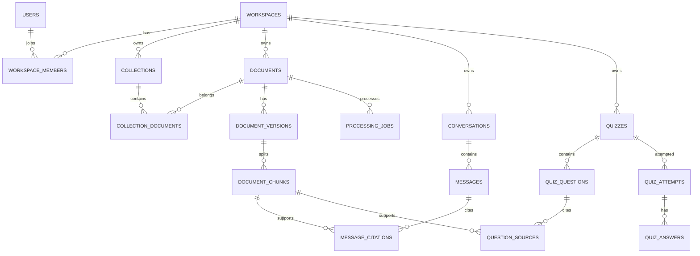

# 数据库设计文档

版本：0.1
数据库：PostgreSQL 17 + pgvector
状态：Alembic 与最小权限角色已接入；`0002_document_ingestion` 固化资料摄取闭环，`0003_document_list_index` 支持资料库游标读取，`0004_document_tenant_integrity` 强制内容与版本的 workspace 一致性，`0005_worker_heartbeat` 提供 Worker 就绪状态，`0006_document_version_owner` 约束版本归属，`0007_unified_citation_locator` 增量加入 PDF/DOCX/PPTX 统一来源定位。RAG、认证成员关系与 Quiz 表仍待对应阶段迁移。

## 1. 设计目标

- 数据隔离优先于开发便利，所有用户资源都能追溯到 workspace。
- 业务事实只保存一份，派生数据可重建并明确版本。
- 支持异步任务的幂等、重试、审计和故障恢复。
- 常见列表、权限过滤和 RAG 检索有稳定索引路径。
- schema 通过迁移演进，支持先部署兼容结构、再切换代码、最后清理旧结构。

## 2. 数据分类与存储位置

| 数据 | 存储 | 说明 |
| --- | --- | --- |
| 用户、空间、文档元数据 | PostgreSQL | 权限与业务事实 |
| 原始 PDF/DOCX/PPTX | 对象存储 | 私有 bucket，数据库保存对象键和哈希 |
| 当前有序正文 | PostgreSQL `document_pages` | 兼容表名；保存页、标题段或幻灯片及统一 locator |
| 文本分块与来源定位 | PostgreSQL | RAG 的可追溯最小单元 |
| Embedding | pgvector | 派生数据，带模型与索引版本 |
| 对话、Quiz、作答 | PostgreSQL | 业务记录与学习历史 |
| 当前处理任务 | PostgreSQL `processing_jobs` | 可租约领取、审计和幂等重试；当前不依赖 Redis |
| 密钥 | Secret Manager | 禁止保存明文 API key 到业务表 |

## 3. 命名与通用字段

- 表名、列名使用 `snake_case`，表名使用复数。
- 内部主键优先 `bigint generated always as identity`，保证索引紧凑和连接性能。
- 对外暴露不可枚举的 `public_id uuid`，默认 `gen_random_uuid()`，并设唯一索引。
- 时间使用 `timestamptz`、UTC；命名 `created_at`、`updated_at`、`deleted_at`。
- 状态使用数据库可约束的 `text + CHECK`；高频变更状态不使用 PostgreSQL ENUM，避免迁移摩擦。
- 金额/Token 使用整数；模型费用可保存最小货币单位或高精度 numeric。
- 业务表包含 `workspace_id`；API 不接受客户端指定不属于自己的 workspace。
- 乐观并发使用 `version integer`，更新时比较版本防止静默覆盖。

## 4. 实体关系

## 5. 表设计

### 5.1 身份与租户

#### `users`

| 字段 | 类型 | 约束/用途 |
| --- | --- | --- |
| id | bigint identity | PK，内部使用 |
| public_id | uuid | UNIQUE，对外 ID |
| auth_subject | text | UNIQUE，认证系统用户标识 |
| email_normalized | text | 可选；UNIQUE，最小化保存 |
| status | text | active / suspended / deleted |
| created_at / updated_at | timestamptz | 审计时间 |

密码认证若交给外部身份服务，数据库不保存密码。若未来自建认证，密码哈希必须进入独立认证 schema，使用成熟密码哈希算法和轮换策略。

#### `workspaces`

当前迁移包含 `id`、`public_id`、`name`、`status`、`created_at`、`updated_at`。`owner_user_id`、成员和套餐字段等待认证方案确定后再扩展，避免先写入虚假身份模型。

即使 MVP 是个人空间，也保留 workspace 边界，避免未来给所有表补租户列。

#### `workspace_members`

联合唯一键 `(workspace_id, user_id)`；角色为 `owner/admin/member/viewer`。权限仍由应用层集中计算，角色字符串不直接等于所有操作权限。

### 5.2 资料与索引

#### `collections`

`workspace_id`、`public_id`、`name`、`description`、时间字段和可选软删除字段。

#### `documents`

| 字段 | 类型 | 说明 |
| --- | --- | --- |
| workspace_id | bigint | 所有权，NOT NULL |
| public_id | uuid | 对外 ID |
| original_filename | text | 展示名称，不作为路径 |
| media_type | text | 服务端检测后的 MIME |
| byte_size | bigint | CHECK > 0 |
| sha256 | char(64) | 内容哈希 |
| object_key | text | 私有对象键，workspace 内唯一 |
| status | text | 文档状态机 |
| active_version_id | bigint | 当前可检索版本，可空 |
| failure_code | text | 稳定错误码，不保存敏感堆栈 |
| page_count | integer | 兼容字段；表示当前版本内容单元数，新接口暴露为 `content_count` |
| language_code | text | 可空，BCP 47 风格代码 |
| created_by | bigint | 上传用户 |
| created_at / updated_at / deleted_at | timestamptz | 生命周期 |

当前 MVP 对未删除资料使用 `(workspace_id, sha256)` 部分唯一索引，重复上传返回已有资料，避免重复解析。若产品允许同一内容以多个展示实体存在，再通过独立 content object 表分离物理去重与业务文档。

#### `document_versions`

当前保存 `document_id`、`workspace_id`、`version_no`、来源哈希、解析器名称/版本、状态、内容单元数和时间。唯一键 `(document_id, version_no)` 以及 `(document_id, source_sha256, parser_name, parser_version)` 防止任务重放重复创建版本；复合外键保证 active version 属于对应 document。

新索引完成前不改 `documents.active_version_id`。切换和版本状态更新在同一事务完成。

#### `document_pages`

该表名与 `page_number` 是 PDF 阶段留下的兼容命名，应用层把 `page_number` 解释为从 1 开始的内容单元 `ordinal`。每行还保存 `locator_kind`（page / heading / slide）、`locator_position`、可选 `locator_title` 和 JSON 标题路径 `locator_path`。旧 PDF 行由迁移回填为 page locator。`(document_version_id, page_number)` 唯一；复合外键保证内容与版本属于同一 workspace，读取仍必须同时经过 workspace、document 和 active version 过滤。

#### `document_chunks`

| 字段 | 类型 | 说明 |
| --- | --- | --- |
| document_version_id | bigint | FK，级联删除版本 |
| workspace_id | bigint | 反规范化用于强制权限过滤 |
| ordinal | integer | 版本内稳定顺序 |
| content | text | 清洗后的检索正文 |
| token_count | integer | 上下文预算 |
| source_type | text | page / heading / slide，与 citation locator 一致 |
| source_start / source_end | integer | 页码或幻灯片范围 |
| heading_path | text[] | 章节路径 |
| metadata | jsonb | 低频、非核心的解析元数据 |
| content_tsv | tsvector | 关键词检索字段 |
| embedding | vector(N) | N 在选择模型后由迁移固定 |

唯一键 `(document_version_id, ordinal)`。`workspace_id` 必须与关联 document 一致，写入由受控 Repository 保证并通过集成测试覆盖。

Embedding 维度不能模糊配置后直接上线。首个模型确定后固定 `vector(N)` 并建立索引；更换不同维度模型时创建新列/表或新版本迁移并完整重建，禁止混放不同维度。

#### `collection_documents`

联合主键 `(collection_id, document_id)`，包含 `added_at`、`added_by`。

### 5.3 任务与可靠性

#### `processing_jobs`

包含 `public_id`、`workspace_id`、`document_id`、`job_type`、`idempotency_key`、`status`、`attempt_count`、`max_attempts`、`available_at`、`lease_expires_at`、`failure_code`、`failure_message`、`retry_of_job_id` 和时间字段。

唯一键 `(workspace_id, job_type, idempotency_key)`。不要把完整异常、模型正文或文件内容塞入 `failure_detail`；详细诊断进入受控日志系统。

#### `worker_heartbeats`

保存 `worker_id`、`worker_type`、`started_at` 和 `last_seen_at`。Worker 以固定间隔 upsert；API 只按类型读取最新心跳并结合过期阈值返回就绪状态。该表仅用于可用性判断，不替代任务状态或审计记录。

#### `outbox_events`

包含 `aggregate_type`、`aggregate_id`、`event_type`、`payload jsonb`、`created_at`、`published_at`、`attempts`。业务写入与 outbox 写入同一事务；发布器使用 `FOR UPDATE SKIP LOCKED` 批量领取。

### 5.4 对话与引用

#### `conversations`

保存 `workspace_id`、`public_id`、`title`、`created_by`、`scope_snapshot jsonb` 和时间字段。scope snapshot 保存当时选中的 collection/document public IDs，便于重现对话范围。

#### `messages`

保存角色、内容、状态、模型、Prompt 版本、输入/输出 Token、延迟、错误码和时间。原始 provider response 只在确有审计需求时加密、限时保存。

#### `message_citations`

关联 message 与 chunk，保存引用顺序、引用文本范围、相关性分数和显示标签。引用指向特定 document version，保证文档重新索引后历史回答仍可解释。

### 5.5 Quiz 与作答

#### `quizzes`

保存 workspace、标题、状态、生成配置 JSONB、资料范围快照、版本、题数、Prompt/模型版本、创建者和时间。

#### `quiz_questions`

保存 `quiz_id`、`ordinal`、`question_type`、题干、选项 JSONB、正确答案 JSONB、解析、难度、知识点、验证状态。选项/答案使用 JSONB 是因为题型结构不同，但必须经过版本化 Pydantic schema 校验。

#### `question_sources`

关联题目与 chunk，保存引用片段与顺序。没有有效 source 的生成题不得进入 ready 状态。

#### `quiz_attempts` / `quiz_answers`

attempt 保存用户、开始/提交时间、状态、总分与 Quiz 版本；answer 保存题目、用户答案、得分、反馈和评分方式。唯一键 `(attempt_id, question_id)` 防止重复答案。

## 6. 索引策略

初始索引按真实查询建立：

- 所有外键列建立 B-tree 索引。
- `documents(workspace_id, status, created_at DESC, id DESC)` 支持列表游标。
- `documents(workspace_id, sha256)` 支持重复检测。
- `document_chunks(document_version_id, ordinal)` 支持顺序读取。
- `document_chunks USING GIN(content_tsv)` 支持全文检索。
- `document_chunks USING hnsw (embedding vector_cosine_ops)` 支持向量检索。
- `processing_jobs(status, available_at)` 对待处理状态建立部分索引。
- `messages(conversation_id, created_at, id)` 支持消息游标。
- 高频软删除表使用 `WHERE deleted_at IS NULL` 的部分索引。

向量查询必须先应用 workspace、active version 和 document scope。若过滤后 HNSW 召回不足，应根据 `EXPLAIN (ANALYZE, BUFFERS)` 调整候选数量、迭代扫描或采用按租户/规模分区，而不是取消权限过滤。

索引会增加写放大；未被查询计划使用的索引应删除。上线前用代表性数据验证索引大小、写入速度和召回质量。

## 7. 安全控制

### 7.1 角色与权限

生产至少分离：

- `app_runtime`：业务表所需 SELECT/INSERT/UPDATE/DELETE，无 DDL、无超级用户权限。
- `app_migrator`：仅部署时使用，拥有迁移所需 DDL。
- `readonly_ops`：受审计的只读排障角色，不可读取高敏感列或原文正文。

应用启动时拒绝使用超级用户。生产数据库不直接暴露公网，强制 TLS，限制安全组来源和连接数。

当前 Compose 基线使用三类凭据：管理员只供 PostgreSQL 初始化和一次性角色配置，`review_agent_migrator` 拥有应用 schema 并执行 Alembic，`review_agent_app` 只拥有应用 schema 的 DML 与序列使用权限。Alembic 版本表位于独立的 `review_agent_migrations` schema，运行账号无权读取或修改。运行账号同时被撤销数据库临时对象权限，不能执行持久或临时 DDL。

### 7.2 租户隔离

应用查询必须强制 workspace scope；生产多租户阶段建议启用 PostgreSQL Row Level Security 作为第二道防线。每个事务设置经过验证的 workspace 上下文，RLS policy 根据该上下文限制行。

RLS 不能替代应用授权；后台任务、迁移和管理员连接要明确区分并专项测试，防止拥有 `BYPASSRLS` 的连接被普通请求复用。

### 7.3 敏感数据

- 连接串、密码、模型 key 不进入表、镜像、Git 或普通日志。
- 对确需保存的 provider payload/用户标识考虑列级应用加密，并由 KMS 管理密钥。
- 备份、只读副本、导出文件与主库同级保护。
- 删除账户或 workspace 采用可审计任务清理数据库、对象存储、缓存和派生向量。

## 8. 迁移规范

使用 Alembic，迁移文件进入代码审查。生产采用 expand/migrate/contract：

1. Expand：添加可空字段/新表/兼容索引，不破坏旧代码。
2. Migrate：后台回填，带断点、限速、指标和一致性校验。
3. Switch：部署读取新结构的代码。
4. Contract：确认无旧版本运行后再删除旧列或约束。

首个 `0001_database_baseline` revision 不创建业务表，用于让空库和当前无业务表的开发数据库进入统一迁移历史。`0002_document_ingestion` 只增加第一份资料闭环所需的五张表、约束和索引，不预建全部业务表。现有数据库接入时先运行幂等角色配置，再执行 `alembic upgrade head`；升级不删除已有资料。生产回退优先用前滚修复；`0002` 的 downgrade 会删除资料表，只允许在无数据的临时环境演练。

大表索引尽量并发创建；会锁表的迁移先在生产等量数据上演练。迁移脚本不调用外部服务、不依赖应用当前业务状态，也不在单事务中执行不可控的全表重写。

## 9. 备份与恢复

- 启用自动全量备份与 WAL/PITR，保留周期由数据政策确定。
- 对象存储开启版本控制或软删除期，并与数据库备份窗口协调。
- 至少按季度执行恢复演练；“备份成功”不等于“可恢复”。
- 记录 RPO/RTO 目标并在规模/商业要求明确后固化。MVP 建议目标：RPO ≤ 24 小时、RTO ≤ 4 小时，生产付费版本应进一步收紧。
- pgvector 内容可由原文和版本化配置重建，但重建成本高；正常备份仍包含向量。

## 10. 性能与容量治理

- 连接池总量按数据库上限在所有 API/Worker 副本间预算，避免每个进程使用过大默认池。
- 开启慢查询采样和 `pg_stat_statements`，定期查看高总耗时与高频查询。
- autovacuum、表膨胀、索引命中率、缓存命中率、锁等待和复制延迟进入监控。
- 分区只在表达到实测规模、维护或删除成为问题时引入；候选是 messages、jobs 和审计事件的时间分区。
- JSONB 只存低频或多态字段；需要过滤、排序、连接的核心字段提升为明确列。

## 11. 数据库上线检查表

- 所有迁移从空库和上一生产版本均能成功执行。
- 外键删除语义经过确认，未出现意外级联删除。
- workspace 隔离与越权测试通过。
- 高频查询保存 `EXPLAIN ANALYZE` 基线。
- 连接使用非超级用户、TLS 与秘密注入。
- 备份、PITR、对象存储恢复和删除流程已演练。
- 生产告警覆盖连接耗尽、磁盘、锁、慢查询、复制与备份失败。
